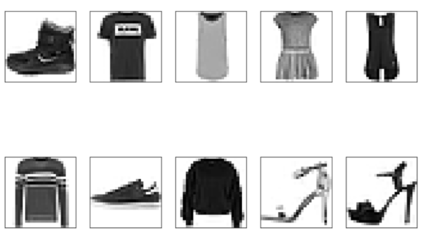
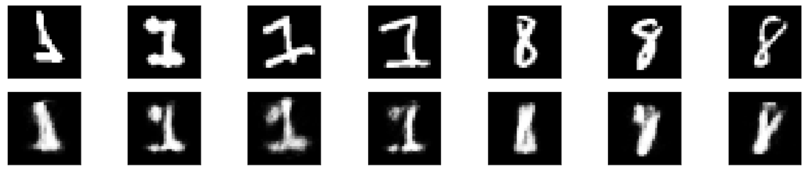

# Detection of outliers using Autoencoder  (Deep learning project)
By Yun RU & Xuran HUANG

Our reproducible python notebook is in repository. 

## :chicken:Introduction
There exists many ways to detect anomaly, One-class SVMs, Elliptic Envelopes... These methods belong to the field of machine learning, however there are also many models for anomaly detection in deep learning area. Autoencoders, a type of unsupervised neural network, are exactly one of the models. In the following sections, we will apply three different autoencoders which are simple autoencoder, deep fully-connected autoencoder and variational autoencoder, to detect the outliers in the datasets that we built based on MNIST data and fashionMNIST data and compare their results.

## :chicken:How to detect the outliers by using autoencoder?

The algorithm of autoencoder is composed by two parts: encoder and decoder. The encoder consists in compressing the inputs into a lower-dimensions space (so-called latent-space) and then the decoder attempts to reconstruct the original data based one the lower-dimensions space. The model of autoencoder is a special type of neural network where the hidden layers have fewer neurons than the input layer and the output layer. This condition forces the hidden layers to extract the most important information from the input and get rid of the noises. The reconstructed images often lose some information compared to the original data, thus we could measure the MSE (Mean Square Error) between them to evaluate the performance of the autoencoder.

&nbsp;

Given the information above, how can autoencoder detect the outliers? Let's take the case of image for example. Imagine that we trained thousands of images of tiger, our autoencoder will then be familiar with the pictures of tiger and know how to reconsctruct them with the lowest loss. However, if we give the autoencoder an image of elephant, the autoencoder do not know how to recontruct it into an elephant since it has never seen it before and the output image will look different from the original image, hence we obtain a high MSE for the outliers. By looking for the observations who have a high MSE between the reconstructed image and original image, we will find the outliers!

## :chicken:Data discription (MNIST & Fashion MNIST)

### MNIST Dataset

MNIST is a large database containing 70 000 handwritten digits images. 60 000 of them are in the built-in training set and 10 000 are in the built-in test set. Each image is stored as a 28\*28 matrix of pixel. Since we can not train each image as matrix, we flatten the 28\*28 matrix into a vector with 784 elements and we normalize the data. We also possess a label variable which indicates the digit number of the image. In order to adapt to our framework of anormaly detection, we have to rebuild the training set and test set. Before doing so, we want to distinguish two concepts: novelty detection and outlier detection. 

**Novelty detection**: The training data consists only of normal observations but the test set contains some new data that the training model has never seen.

**Outlier detection**: The training data consists of both normal data and outliers.

Some papers did the novelty detection and others did the outilier detection. We want to do both of them, so we created 3 data frameworks. The detailed information is as follow:

\**The number of anomalies account for 5% of the number of normal data in both training set and test set, the valid label is the label of the normal and the anormal label is the label for the anomaly*

**Data framework 1** can be considered as novelty detection, since it contains 0 anomaly in the training set 

**Data framework 2** can be considered as outlier detection, there are 337 outliers in the training set. 

**Data framework 3** can be considered as novelty detection, but we consider all the labels except 8 as normal data

These 3 dataframes will be applied to the different models of autoencoder.

### Fashion MNIST Dataset

Similar to the MNIST dataset, the Fashion MINIST contains 60 000 images in the training set and 10 000 in the test set and the images are also stored as a 28\*28 matrix. The difference is that the images are changed to clothing images. There are ten types of clothing, their types matched with the lable numbers are as follow:

0 T-shirt/top 1 Trouser 2 Pullover 3 Dress 4 Coat 5 Sandal 6 Shirt 7 Sneaker 8 Bag 9 Ankle boot

We also built the data framework 4 for the Fashion MNIST Dataset

## :chicken:Three methods applied and their performances

Having read several papers, we decided to implement three autoencoder models below:

**Simple autoencoder**: Simple autoencoder is the simplest model to start with. It is consist of an encoder model with a single fully-connected layer, and a decoder model also with a single fully-connected layer. We use 'sigmoid' as activation function for decoder layer because we want a binary result.

**Deep fully-connected autoencoder**: Instead of using one layer for encoder model and decoder model respectively, we can use several layers to add complexity to the model. More layers allow the model to learn more detailed relationships within the data and how the features interact with each other on a non-linear level.

**Variational autoencoder**: A traditional autoencoder takes in a vector and generates a latent vector (smaller dimension than the initial vecotr) which decoder model can reproduce. But it is possible that the encoder chooses to position two similar data points relatively far from each other in latent space if that minimizes the reconstruction loss. The output of the encoder function in such architecture generates a discrete latent space and often resembles an overfitted model. As a result, although an autoencoder can form a latent space that allows it to be very accurate in its task, there is not much we can assume on the distribution and topology of the latent space it generates, or on how data is organized there. So we have variational autoencoder which generates two vectors which are mean and variance of the latent vector. What's more, variational autoencoder's loss function takes into account a construction loss component which forces the encoder to generate latent features that minimize the reconstruction loss, and a KL loss component, which forces the distribution generated by the encoder to be similar to the prior probability of the input vector (assumed to be normal). So we get a more contiunous and smoother latent space.

-- Description refers to *Hands-on Anomaly Detection with Variational Autoencoders*

### :star2:**Process**

First of all, we applied the simple autoencoder on the data framework 1 and data framework 2 

\* *These images are the outliers that have not been detected in data framework 1. The first line is the original images and the second line is the corresponding reconstructed imgages. The reconstructed images look quite similar to the original one, so their MSEs are not as high as we expected. This is why they were not detected*

And then we compared the performance of the two cases.

\***Outlier recall** measures the proportion of the outliers detected by the model among all the outliers and **Accuracy** measures the proportion of correct classifications in the whole dataset (include the good classification of normal data)

We can see that the performance of Data framework 1 is better than the data framework 2. This is logical because in data framework 2, the training set is contaminated by some outliers. If we train the autoencoder with a dataset including the outliers, the autoencoder may perform well for reconstructing the outliers in the test set since it has seen the outlier in the training set. Thus the mse between the reconstruction and the original image will not be higher than the others, which make us fail to detect some outliers.  

Consequently, in pratical, when we want to detect outliers, it is better to train your autoencoder without any outliers. If it is hard to get rid of the outliers from your training set, you can train you autoencoder with a small proportion of outliers. However, the performance will be that good.

As we can get rid of the outliers in the training set, we will not use data framework 2 any more in the following project. We consider only the non-contaminated training set.

Then we applied the three autoencoder models mentioned above respectively on three data frameworks. We used handwriting digits dataset in two different ways: one with single normal digit (Data framework 1) and another with several normal digits (Data framework 3). The aim is to test whether the performance of models will differ largely in dataset with more complex composition. We used both handwriting digits dataset (Data framework 1 and 3) and clothing dataset (Data framework 4) to see the performance of models in different kinds of dataset. Here are the results.

In data framework 1, deep autoencoder has the best performance; in data framework 3 and 4, simple autoencoder has the best performance. In a more complex dataset (comparing data framework 1 and 3), the performance of all the models decrease significanly. In different kinds of dataset with single normal image (comparing data framework 1 and 4), the performance of models are quite well and similar. Variational autoencoder give the worst result in three cases, so the increase of model’s complexity doesn’t increase certainly the performance of detection, it depends on the data framework we are working on. 

## :chicken:Strengths and Weaknesses
Strengths: We tested different autoencoders on different data frameworks.

Weaknesses: We didn't find appropriate way to adjust parameters in neural network framework.

## Reference
https://blog.keras.io/building-autoencoders-in-keras.html

https://github.com/a-agmon/anomaly_det/blob/master/AnomalyDetectorsVAE-KDD-original.ipynb

https://www.analyticsvidhya.com/blog/2021/05/anomaly-detection-using-autoencoders-a-walk-through-in-python/

https://www.pyimagesearch.com/2020/03/02/anomaly-detection-with-keras-tensorflow-and-deep-learning/
